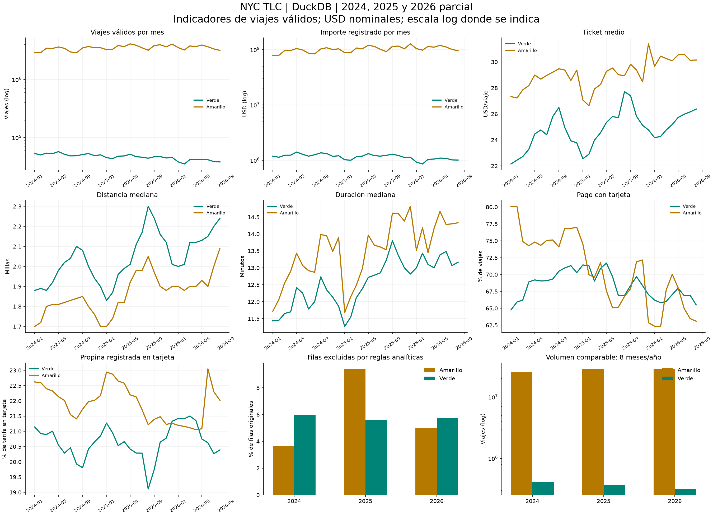
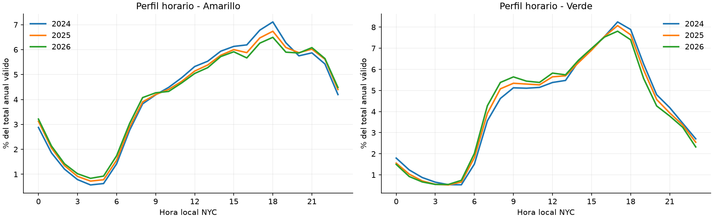

# Informe de resultados - Laboratorio 8

Resultados calculados sobre datos oficiales; fecha exacta, archivos y versiones en los manifiestos y metadata.json. Las preguntas y reglas están en [metodologia.md](metodologia.md).

## Ejercicios 3 y 4: exploración directa y hallazgos iniciales

| taxi | source_year | files | rows | earliest_pickup | latest_pickup |
|---|---|---|---|---|---|
| green | 2026 | 8 | 337114 | 2008-12-31 17:35:31 | 2026-08-31 23:58:28 |
| yellow | 2026 | 8 | 29703355 | 2001-01-01 09:23:58 | 2026-08-31 23:59:59 |

**Escala del servicio.** Se observan 28,219,350 viajes válidos amarillos y 317,814 verdes: razón 88.8:1. Una visualización con escala única lineal ocultaría las variaciones de green.

**Ticket y horario (Amarillo).** El importe medio ponderado por viaje es USD 30.24; la hora con mayor conteo es 18:00. Es una asociación descriptiva y agrega meses de distinta exposición.

**Ticket y horario (Verde).** El importe medio ponderado por viaje es USD 25.35; la hora con mayor conteo es 17:00. Es una asociación descriptiva y agrega meses de distinta exposición.

**Calidad.** Se excluyen 1,503,305 de 30,040,469 filas (5.00%). Los conteos originales permanecen disponibles y los motivos pueden solaparse. El análisis describe la población filtrada y no todos los viajes registrados.

**Fechas y faltantes.** Se detectan 244 filas con pickup fuera del mes/año del archivo o nulo y 7,765,463 filas sin passenger_count. El año analítico proviene del archivo y se valida contra pickup; no se imputan pasajeros.

Las consultas, objetivos, fuentes, resultados y decisiones de esta etapa están en [results/initial_2026/queries.md](results/initial_2026/queries.md).

## Ejercicio 5: incorporación de 2024

| taxi | source_year | files | rows | earliest_pickup | latest_pickup |
|---|---|---|---|---|---|
| green | 2024 | 12 | 660218 | 2008-12-31 00:00:00 | 2025-01-01 22:21:15 |
| green | 2026 | 8 | 337114 | 2008-12-31 17:35:31 | 2026-08-31 23:58:28 |
| yellow | 2024 | 12 | 41169720 | 2002-12-31 16:46:07 | 2026-06-26 23:53:12 |
| yellow | 2026 | 8 | 29703355 | 2001-01-01 09:23:58 | 2026-08-31 23:59:59 |

Las mismas consultas se ejecutaron sin cambiar su lógica; se amplió únicamente la lista de años. La normalización tpep/lpep y union_by_name resuelven nombres/columnas diferentes. El manifiesto expanded muestra los registros de 2026 como existing y los de 2024 como downloaded.

## Ejercicio 6: Parquet versus tabla materializada

| scale | files | rows | materialization_seconds | database_bytes | parquet_bytes |
|---|---|---|---|---|---|
| 2026_one_month | 2 | 3765161 | 1.0757141659996703 | 96743424 | 65156736 |
| 2026 | 16 | 30040469 | 7.860672791997786 | 775696384 | 519727000 |
| 2024_2026 | 40 | 71870407 | 18.199607167000067 | 1826893824 | 1228648745 |
| 2024_2025_2026 | 64 | 121184384 | 30.89101849999861 | 3110088704 | 2073081961 |

| scale | query | duckdb | parquet | speedup_parquet_over_duckdb |
|---|---|---|---|---|
| 2024_2025_2026 | distribution | 7.325803416999406 | 6.794840625007055 | 0.9275215615586597 |
| 2024_2025_2026 | hourly | 0.6591799169982551 | 1.1341338329948485 | 1.7205224305974278 |
| 2024_2025_2026 | monthly | 0.6331110000028275 | 0.5018412080098642 | 0.7926591198188359 |
| 2024_2025_2026 | top_zones | 0.6274890830100048 | 0.7504995420022169 | 1.1960360145265678 |
| 2024_2026 | distribution | 4.423730542010162 | 5.083038542012218 | 1.1490389149476685 |
| 2024_2026 | hourly | 0.3596856250078417 | 0.6010909589967923 | 1.6711564688849816 |
| 2024_2026 | monthly | 0.4110791249986505 | 0.3254864579939749 | 0.7917854208603841 |
| 2024_2026 | top_zones | 0.3754980829980923 | 0.4285554579982999 | 1.141298657443418 |
| 2026 | distribution | 1.0706154169893125 | 1.4356914999953003 | 1.3409964747496554 |
| 2026 | hourly | 0.152319125001668 | 0.2531284589931601 | 1.6618297865772809 |
| 2026 | monthly | 0.1640615420037647 | 0.1242136249929899 | 0.7571160399683405 |
| 2026 | top_zones | 0.1538623749947874 | 0.194005167009891 | 1.260900639395847 |
| 2026_one_month | distribution | 0.1198573750007199 | 0.1225617089949082 | 1.022562933604812 |
| 2026_one_month | hourly | 0.0221758750121807 | 0.0377627499983646 | 1.7028753083078971 |
| 2026_one_month | monthly | 0.0233327079913578 | 0.0199782499985303 | 0.85623366160199 |
| 2026_one_month | top_zones | 0.0228000829956727 | 0.0267534580052597 | 1.173393009592874 |

Un cociente mayor que 1 favorece la tabla DuckDB; menor que 1 favorece Parquet. Los tiempos son de caché caliente y no incorporan descarga. La materialización sí se mide por separado. No basta con comparar una sola consulta: CTAS y espacio adicional deben amortizarse.

Para **distribution**, la mediana final fue 6.7948s en Parquet y 7.3258s en tabla (cociente 0.93).

Para **hourly**, la mediana final fue 1.1341s en Parquet y 0.6592s en tabla (cociente 1.72).

Para **monthly**, la mediana final fue 0.5018s en Parquet y 0.6331s en tabla (cociente 0.79).

Para **top_zones**, la mediana final fue 0.7505s en Parquet y 0.6275s en tabla (cociente 1.20).

La ronda completa no ahorra tiempo al materializar en esta medición; no hay punto de amortización positivo observado.

Parquet conviene para exploración puntual, archivos que llegan continuamente y evitar otra copia. Materializar conviene cuando las consultas repetidas compensan CTAS y se necesita un snapshot estable. Una tabla requiere refresco explícito; los Parquet nuevos no aparecen automáticamente en ella.

## Ejercicio 7: indicadores y tablero

Las 13 preguntas y justificaciones están en metodologia.md. Las tarjetas de Metabase usan sql/dashboard/ y agregados calculados con sql/04..10. El script setup_metabase.py reconstruye el tablero; docs/dashboard.json registra IDs y consultas. Las interpretaciones están en las descripciones de las tarjetas y se respaldan con estos resultados.

**Escala del servicio.** Se observan 112,049,120 viajes válidos amarillos y 1,496,931 verdes: razón 74.9:1. Una visualización con escala única lineal ocultaría las variaciones de green.

**Ticket y horario (Amarillo).** El importe medio ponderado por viaje es USD 29.14; la hora con mayor conteo es 18:00. Es una asociación descriptiva y agrega meses de distinta exposición.

**Ticket y horario (Verde).** El importe medio ponderado por viaje es USD 24.75; la hora con mayor conteo es 17:00. Es una asociación descriptiva y agrega meses de distinta exposición.

**Calidad.** Se excluyen 7,638,333 de 121,184,384 filas (6.30%). Los conteos originales permanecen disponibles y los motivos pueden solaparse. El análisis describe la población filtrada y no todos los viajes registrados.

**Fechas y faltantes.** Se detectan 1,290 filas con pickup fuera del mes/año del archivo o nulo y 23,542,797 filas sin passenger_count. El año analítico proviene del archivo y se valida contra pickup; no se imputan pasajeros.

## Ejercicio 8: evolución de tres años en meses comparables

| taxi | year | trips | months | total_usd | avg_total_usd | avg_miles | avg_minutes | credit_pct | avg_cbd_fee_usd |
|---|---|---|---|---|---|---|---|---|---|
| green | 2024 | 416778 | 8 | 9893050.07 | 23.737 | 2.912 | 14.418 | 67.798 | NULL |
| green | 2025 | 374124 | 8 | 9289907.96 | 24.831 | 3.095 | 15.251 | 69.761 | 0.074 |
| green | 2026 | 317814 | 8 | 8055536.36 | 25.347 | 3.293 | 16.852 | 66.576 | 0.063 |
| yellow | 2024 | 25492745 | 8 | 722075478.03 | 28.325 | 3.422 | 16.387 | 75.939 | NULL |
| yellow | 2025 | 28683362 | 8 | 814054991.63 | 28.381 | 3.451 | 16.456 | 68.729 | 0.547 |
| yellow | 2026 | 28219350 | 8 | 853420130.21 | 30.242 | 3.515 | 17.661 | 65.397 | 0.543 |

### Interpretación numérica de las siete tarjetas mensuales

**Viajes válidos por mes (2026-08):** amarillo 3,162,287.000 viajes; verde 38,151.000 viajes. El mayor volumen explica parte de la diferencia de importe agregado; no equivale a mayor ingreso por conductor.

**Importe registrado por mes (2026-08):** amarillo 95,342,533.200 USD; verde 1,006,178.370 USD. El mayor volumen explica parte de la diferencia de importe agregado; no equivale a mayor ingreso por conductor.

**Ticket medio (2026-08):** amarillo 30.150 USD/viaje; verde 26.374 USD/viaje. Se compara la población válida del mismo mes; la diferencia es descriptiva y puede reflejar composición de recorridos y pasajeros.

**Distancia mediana (2026-08):** amarillo 2.090 millas; verde 2.240 millas. Se compara la población válida del mismo mes; la diferencia es descriptiva y puede reflejar composición de recorridos y pasajeros.

**Duración mediana (2026-08):** amarillo 14.333 minutos; verde 13.167 minutos. Se compara la población válida del mismo mes; la diferencia es descriptiva y puede reflejar composición de recorridos y pasajeros.

**Pago con tarjeta (2026-08):** amarillo 63.085 %; verde 65.505 %. Se compara la población válida del mismo mes; la diferencia es descriptiva y puede reflejar composición de recorridos y pasajeros.

**Propina registrada en tarjeta (2026-08):** amarillo 22.018 % de tarifa en tarjeta; verde 20.390 % de tarifa en tarjeta. Se compara la población válida del mismo mes; la diferencia es descriptiva y puede reflejar composición de recorridos y pasajeros.

**Patrón de volumen (Amarillo):** 2024→2025: +12.52%; 2025→2026: -1.62%. Se usan 8 meses comunes; no se extrapola al resto de 2026.

**Ticket y mezcla (Amarillo):** ticket medio USD 28.32 → 28.38 → 30.24 (+6.77% de 2024 a 2026). La proporción de tarjeta cambia -10.54 puntos porcentuales. La comparación es descriptiva: composición, precios y reglas de registro pueden cambiar simultáneamente.

**Patrón de volumen (Verde):** 2024→2025: -10.23%; 2025→2026: -15.05%. Se usan 8 meses comunes; no se extrapola al resto de 2026.

**Ticket y mezcla (Verde):** ticket medio USD 23.74 → 24.83 → 25.35 (+6.78% de 2024 a 2026). La proporción de tarjeta cambia -1.22 puntos porcentuales. La comparación es descriptiva: composición, precios y reglas de registro pueden cambiar simultáneamente.

**Cambio de esquema:** cbd_congestion_fee aparece desde 2025 según TLC. En 2024 el indicador conserva NULL. El ticket nominal incluye cargos y no mide un cambio causal atribuible al recargo. La evolución por mes y la distribución aportan contexto adicional.

**Interpretación de pagos:** el código 0 identifica viajes Flex Fare, no un instrumento de pago. Una menor proporción de código 1 no demuestra mayor uso de efectivo. total_amount excluye propinas en efectivo según los diccionarios TLC.

## Ejercicio 9: discusión

**9.1. Características útiles.** Lectura directa de Parquet, SQL analítico (ventanas, cuantiles, agrupaciones), union_by_name, ejecución en proceso y proyección de columnas. No se necesita administrar un servidor para el análisis.

**9.2. Parquet.** Evita importar y duplicar todos los datos; conserva el formato original. La proyección y filtros pueden reducir lectura. Como límites, los archivos requieren gestión de esquemas/particiones y consultas repetidas pueden volver a decodificar columnas. COUNT puede aprovechar metadatos, por eso se incluyeron otras consultas en el benchmark.

**9.3. Tablas materializadas.** Ofrecen una copia normalizada estable y pueden acelerar consultas repetidas según la medición. Cuestan tiempo CTAS y espacio; requieren actualización e invalidación. Un archivo DuckDB no admite varios procesos escritores simultáneos. Metabase usa otro archivo de agregados con conexión de solo lectura.

**9.4. Frente a cargar todo en Pandas.** DuckDB procesa y agrega columnas antes de convertir el resultado a DataFrame y puede ejecutar fuera de memoria con disco temporal. En este trabajo Pandas recibe tablas pequeñas de resultados. No se midió un benchmark contra Pandas ni se afirma que DuckDB sea siempre más rápido.

**9.5. Incorporación.** Descubrimiento de rutas, años parametrizados, catálogo oficial, omisión con validación de archivos existentes, normalización y consultas sin lista fija de meses. La vista se reconstruye al ejecutar el análisis; la tabla/snapshot se regenera explícitamente.

**9.6. Producción.** Automatizar catálogo, descarga, manifiestos/versionado, validaciones, alertas de cambios de esquema, ejecución de SQL, refresco del snapshot y pruebas de resultados. Una planificación debe respetar reintentos, consistencia y bloqueo de lectores/escritores.

**9.7. Reproducibilidad.** Fork y commits por hitos, dependencias directas fijadas, Docker, rutas relativas al proyecto, SQL versionado, hashes de entradas, manifiestos de etapas, reglas de limpieza explícitas, metadatos del benchmark y evidencia del tablero. Las dependencias transitivas y las imágenes base con tag aún pueden cambiar; no se promete reproducción byte a byte.

**9.8. Aprendizaje con escala.** Separar datos de código, medir costo de importar frente a consultar, reducir columnas antes de mover datos a Python y cuidar espacio temporal se vuelven necesarios. Las fechas anómalas y esquemas que cambian se hacen visibles al unir muchos archivos. Medir una consulta pequeña o cargar una muestra no permite inferir el desempeño del conjunto completo.
