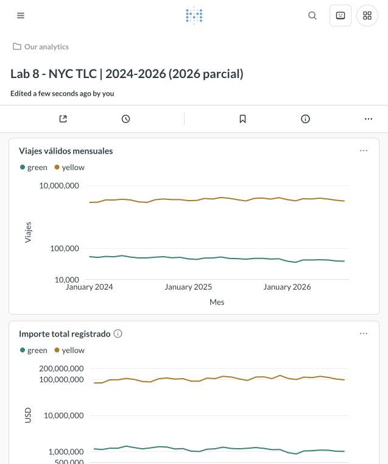

# Tablero Metabase

Tablero local verificado: [Lab 8 - NYC TLC](http://localhost:3000/dashboard/2).
Los IDs pueden cambiar al reconstruir una instalación nueva; consulte dashboard.json.
El servidor corre en Docker y utiliza dashboard.duckdb con `read_only=true`.

Contiene diez tarjetas SQL con datos de ambos taxis y los tres años:
volumen, importe, ticket medio, distancia mediana, duración mediana, participación
del código de tarjeta, propinas registradas en tarjeta, perfil horario, calidad
y demanda en meses comunes. Verde identifica green y dorado identifica yellow.
Las escalas logarítmicas se usan donde las diferencias de volumen son grandes.
El título identifica explícitamente que 2026 es parcial.

Cada consulta fue ejecutada y comprobada mediante el API antes de crear/actualizar
su tarjeta. dashboard.json registra SQL, interpretación y número de filas de
resultado por tarjeta. sql/dashboard contiene los archivos SQL versionados.
Las 13 preguntas y justificaciones están en metodologia.md y las interpretaciones
numéricas de los indicadores están en informe.md. El perfil horario usa proporciones
por tipo/año para ajustar la distinta exposición de 2026.

La evidencia siguiente corresponde al tablero real, revisado en el navegador.
Para reconstruir las tarjetas, ejecute setup_metabase.py según el README. El
script es idempotente y reutiliza IDs cuando el tablero ya existe. La captura es
evidencia de esta ejecución; los gráficos estáticos también se regeneran con
report.py. Las credenciales locales están en .env y no se publican en Git.

